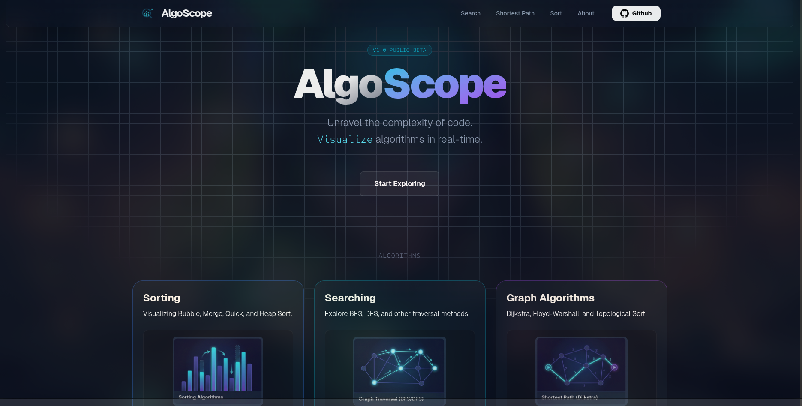
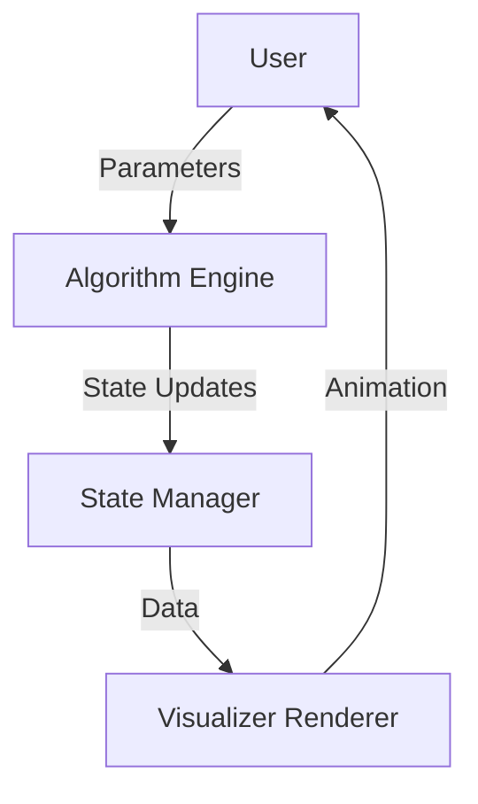

<div align="center">

<!-- Animated Header -->


<!-- Typing Animation -->
<a href="https://git.io/typing-svg"></a>
<p align="center">
  <em>Transforming Ideas into Elegant Digital Experiences</em>
</p>

<!-- Animated Social Badges -->
<p align="center">
  <a href="https://www.linkedin.com/in/bratik-mukherjee/" target="_blank">
    
  </a>
  <a href="https://github.com/Bimbok" target="_blank">
    
  </a>
  <a href="mailto:bimbokmkj@gmail.com">
    
  </a>
  <a href="https://bimbok-portfolio.vercel.app/" target="_blank">
    
  </a>
</p>

<!-- Profile Views & Followers -->
<p align="center">
  
  
  
</p>

</div>

---


<div align="center">

## 🎯 About Me

</div>


```typescript
const Bratik = {
    location: "Kolkata, India 🇮🇳",
    education: "B.Tech IT @ TMSL",
    currentYear: "3rd Year",
    
    code: ["JavaScript", "TypeScript", "Python", "C++", "Bash"],
    
    technologies: {
        frontEnd: {
            js: ["React", "Next.js"],
            css: ["Tailwind", "Bootstrap", "Material-UI"]
        },
        backEnd: {
            js: ["Node.js", "Express"],
            python: ["Django", "Flask"]
        },
        databases: ["MongoDB", "PostgreSQL", "MySQL", "Firebase"],
        devOps: ["Docker", "Kubernetes", "CI/CD", "Nginx", "Vercel"],
        linux: {
            distros: ["Arch Linux (Daily Driver)", "Ubuntu"],
            expertise: ["CLI Automation", "System Hardening", "Shell Scripting"]
        },
        tools: ["Git", "Neovim", "Tmux", "Postman", "Figma"]
    },
    
    currentFocus: "Mastering Cloud Native Ecosystem & Linux Internals",
    learning: ["Rust", "Advanced Kubernetes", "System Design"],
    
    philosophy: "Automation is the ultimate form of laziness (the good kind) 🐧"
};
```

<br clear="right"/>

### 🚀 What I'm Up To

- 🔭 Building a **MERN stack application** with real-time features
- 🌱 Daily driving **Arch Linux** and optimizing my **Linux CLI workflow**
- 🛠️ Automating everything with **Bash scripts** and **DevOps pipelines**
- 👯 Looking to collaborate on **Open Source** & **Infrastructure projects**
- 💼 Open for **internships** and **full-time opportunities**
- 💬 Ask me about **Linux, Docker, Kubernetes**, or **Full-Stack Development**
- ⚡ Fun fact: I use Arch btw (but I started with Ubuntu) 🐧


<div align="center">

## 🏆 Featured Projects

</div>

<div align="center">

### 🌊 [AlgoScope](https://algo-scope-virid.vercel.app/) — Interactive Algorithm Visualizer

<a href="https://algo-scope-virid.vercel.app">
  
</a>

**A modern, interactive algorithm visualizer that demystifies complex logic through real-time, high-fidelity animations.**

[](https://react.dev/)
[](https://vitejs.dev/)
[](https://tailwindcss.com/)
[](https://hub.docker.com/r/bimbok/algoscope-app)

<details>
<summary><b>🔍 Explore AlgoScope Deep Dive</b></summary>

#### 💡 Project Purpose
**AlgoScope** bridges the gap between static pseudocode and dynamic execution. By transforming abstract logic into fluid animations, it helps users build a mental model of how algorithms actually work.

#### ✨ Key Features
- **Real-time Visualization:** Smooth, step-by-step animations using Framer Motion and Anime.js.
- **Algorithm Coverage:** Comprehensive support for Sorting, Searching, and Graph Algorithms.
- **Code Insights:** Multi-language implementation (C++, Java, Python, JS) alongside the visualization.

#### 🏗️ Architecture & Data Flow


</details>

---

### 🌸 [Sizuka Language](https://github.com/Bimbok/Sizuka) — Interpreted JVM Language

**A clean, interpreted programming language built from scratch in Java.**

Sizuka runs on the JVM and features a custom recursive descent parser and a tree-walk interpreter, designed to explore core compiler design concepts.

[](https://www.oracle.com/java/)
[](LICENSE)

<details>
<summary><b>📝 View Syntax & Features</b></summary>

#### ⚡ Features
- **Variables & Arithmetic:** Dynamic typing with `say` keyword and full operator precedence.
- **Packs (Arrays):** Built-in support for dynamic, zero-indexed collections.
- **Control Flow:** `if`/`else` branching, `from` loops, and `while` loops.
- **Interactive REPL:** Instant code execution shell.

#### 📝 Syntax Preview
```text
say x = 10
from 1 to 5 as i {
    out "Sizuka iteration: " + (x * i)
}
```

</details>

</div>


<div align="center">

## 🛠️ Tech Stack & Tools

</div>

### 💻 Languages

<p align="center">
  
</p>

### 🎨 Frontend Development

<p align="center">
  
</p>

### ⚙️ Backend Development

<p align="center">
  
</p>

### 🗄️ Databases & Cloud

<p align="center">
  
</p>

### 🚀 DevOps & Tools

<p align="center">
  
</p>

### 🎨 Design & Other Tools

<p align="center">
  
</p>


<div align="center">

## 📊 GitHub Analytics

</div>

<p align="center">
  
  
</p>

<p align="center">
  
  
</p>

<div align="center">
  
</div>


<div align="center">

## 📝 Latest Blog Posts & Articles

</div>

<div align="center">

[](https://github.com/Bimbok/nvim)

[](https://github.com/Bimbok/myshell)

</div>


<div align="center">

## 💭 Random Dev Quote


</div>


<div align="center">

## 🤝 Let's Connect & Collaborate!

<p align="center">
  <a href="https://www.linkedin.com/in/bratik-mukherjee/">
    
  </a>
  <a href="mailto:bimbokmkj@gmail.com">
    
  </a>
  <a href="https://bimbok-portfolio.vercel.app/">
    
  </a>
  <a href="https://github.com/Bimbok">
    
  </a>
</p>

### 💼 Open for Opportunities

I'm actively seeking **internships** and **full-time roles** in Full-Stack Development, Cloud Engineering, or DevOps. Let's build something amazing together!

<p align="center">
  <em>"Code is like humor. When you have to explain it, it's bad." – Cory House</em>
</p>

</div>

<!-- Animated Footer -->


---

<div align="center">
  
</div>

<div align="center">
  
### Show some ❤️ by starring some repositories!

</div>
